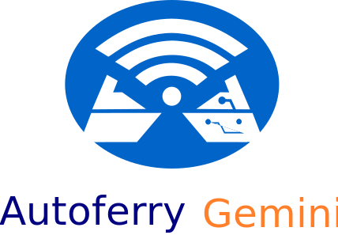

# Note!
**This is the HDRP version of the simulator, this is the version that will be maintained, the old repository has been renamed Autoferry Gemini Legacy
and will not be maintained.**

Autoferry Gemini is a realtime 3D simulation of the **Autoferry** project residing at **NTNU Trondheim**.

The initial goal of this project is to develop a simulation of the autonomous passenger ferry as possible.
We will try to achieve this in numerous ways, where our main focus at the moment are realistic implementations
of sensors and an API that allows us to control the simulation from environments outside of the simulator.

This project includes large amounts of assets files such as textures, 3D models etc. In the legacy version of this
project we were using Git LFS (Large File Storage), but we ran into issues with this. Now our solution is to have all
large assets in a specific folder which we are ignoring in git, and we rather package the contents of the folder into
a untiypackage and store it in the cloud using onedrive.

# Getting started

The first step is to clone the repository. When this is done one must download and unpack the
dependencies that are necessary for the project. It is assumed that Windows 10 is used here since it
is the only OS which the simulator is verified working on.

* Unity dependencies

    * Large assets
    The large assets that are needed for the project are stored as a unitypackage in a OneDrive folder, when needed contact
    one of the maintainers to get access to the unitypackage. After downloading this package import into the project.   
    When this is done you should have a folder named IgnoredAssets under the Assets/ folder. This is the place where you 
    should put all your large assets such as textures 3D models, sound files etc. This is not an ideal solution, but
    the only one that is viable as of right now.

    * Protobuf and gRPC Plugins
    or the API services to work gRPC and Protobuf plugins are needed. These can be downloaded from the 
    following URL: https://packages.grpc.io/archive/2019/12/a02d6b9be81cbadb60eed88b3b44498ba27bcba9-edd81ac6-e3d1-461a-a263-2b06ae913c3f/index.xml

    Download the zipped folder grpc_unity_package.2.26.0-dev.zip. Currently this is the latest version that we have found
    to be working properly, this will probably change in the future.

    When the download is finished, extract the contents into the folder Assets/Networking. Then the following Plugins folder path should be
    Assets/Networking/Plugins. As with the IgnoredAssets folder this folder is also ignored by git because it is quite large.

* Source file generation dependencies

    * C#

        To be able to generate the source files for Protobuf and gRPC the proper compilers are needed.
        Generating the source files for the services located in Unity a Protobuf and gRPC compiler for C# is required.
        These can be found under gRPC protoc Plugins here: https://packages.grpc.io/archive/2020/06/039e7759c5202f7cfb808d4d55d4cde531b951c5-d225705a-89df-4405-a33f-df7d0073a69d/index.xml.

        Download the correct package depending on your OS and whether you are running 32-bit or 64-bit OS.
        Open the zipped folder and unpack the protoc.exe and grpc_csharp_plugin.exe to a new folder Plugins located
        which should be located at Protobuf/Plugins/. These are needed for the generate.sh to be able to generate the
        source files for the services running in Unity.

    * Python

        To be able to generate Protobuf and gRPC source files for Python two dependencies are needed, these can be
        retrieved as Python modules using pip. Run python -m pip install grpcio and python -m pip install grpcio-tools
        to be able to generate Python source files for the clients.

* Generate source files for gRPC and Protobuf

    To generate the Protobuf and gRPC source files for the services in Unity and Python clients a shell script generate.sh has been made.
    The generate.sh script takes in 2 arguments, where the first one is requires. The first argument has to be the name of the .proto file which are placed in
    a folder with the same name in the folder Protobuf/ProtoFiles/. The other argument can be the name of the programming language which the client
    script should be compiled to. At this moment only Python clients are supported by the generate.sh script.
    An example of compiling the protobuf and grpc files for the remotecontrol service is **./generate.sh remotecontrol python**.

    The convention of having the same name on folder which contains the .proto file as the .proto file itself has to be upheld.
    When the generate.sh script has been run it will place the compiled protobuf and grpc source files in the correct directory in the Unity simulation folder
    which is located at Autoferry/Assets/Networking/ProtobufFiles/. The client source files will be put in the Clients/ folder, and depending on which language
    the protobuf and grpc source files are compiled to it will be placed in the corresponding sub folder. At the moment only Clients/PythonClients are       available.

