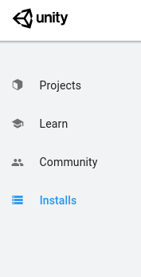
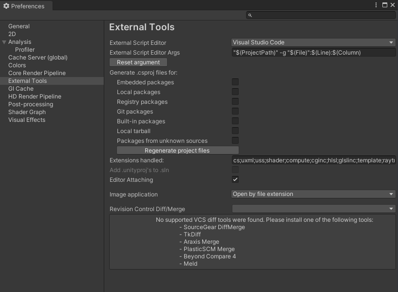

# Installation \(Ubuntu 18.04\)

## Install Unity

Download UnityHub from [https://unity3d.com/get-unity/download](https://unity3d.com/get-unity/download) and install it by running the UnityHub AppImage.

```bash
cd ~/Downloads
./UnityHub.Appimage
```

Then select the Installs menu tab.



Then click the `ADD` button at the top right corner and select which version of Unity to install. This will automatically install the specified version of Unity e.g. **Unity 2019.4.18f1.**

## Development Environment Setup

The development environment setup for Unity on Ubuntu is not as easy and streamlined as on Windows. The default Visual Studio IDE is not available on Ubuntu, so the recommended Text Editor/IDE is Visual Studio Code. To get proper integration with Unity this requires a few steps. 

### Install Visual Studio Code

First download Visual Studio Code for Ubuntu: [https://code.visualstudio.com/download](https://code.visualstudio.com/download) and install it by running the following commands in a bash terminal. Here the `x` represents version numbers, the specific version of Visual Studio Code that you will download will vary by the time of installation.

```bash
cd ~/Downloads
sudo dpkg -i code_x.x.x.deb
```

### Install .NET

In this guide it will be presumed that Ubuntu 18.04 will be used, since the setup are a bit different for other versions. The overview of how to install .NET for other versions can be found here: [https://docs.microsoft.com/en-us/dotnet/core/install/linux-ubuntu](https://docs.microsoft.com/en-us/dotnet/core/install/linux-ubuntu)  
For Ubuntu 18.04 this guide is the one that should be followed:   
[https://docs.microsoft.com/en-us/dotnet/core/install/linux-ubuntu\#1804-](https://docs.microsoft.com/en-us/dotnet/core/install/linux-ubuntu#1804-)  
  
If there is issues when installing .NET e.g. one of the following errors are given `Unable to locate package {dotnet-package}` or `Some packages could not be installed`  
then check out the following guide:   
[https://docs.microsoft.com/en-us/dotnet/core/install/linux-ubuntu\#apt-troubleshooting](https://docs.microsoft.com/en-us/dotnet/core/install/linux-ubuntu#apt-troubleshooting)

### Install Mono C\#

Mono C\# is needed to have fully supported functionality with Unity, such as code completion. Mono can be downloaded and installed by following this guide: [https://www.mono-project.com/download/stable/](https://www.mono-project.com/download/stable/).  
It should be noted that at least the packages `mono-devel`, `mono-complete` and `mono-dbg` should be installed, but there is no real downside to installing the rest of the packages that are mentioned.

## Configuring Visual Studio Code With Unity

It is highly recommended to do the following steps to utilize the functionality of Visual Studio Code with Unity for code completion and Debugging.

1. Install the C\# plugin in Visual Studio Code, can be found under the Extensions tab on the left side menu.
2. Open the `settings.json` file and add the following line:  `"omnisharp.useGlobalMono": "always"` inside the brackets.
3. Add Visual Studio Code as the default Editor for Unity. This can be done by selecting Visual Studio Code in the dropdown located at `Edit->Preferences->External Tools->External Script Editor` 




